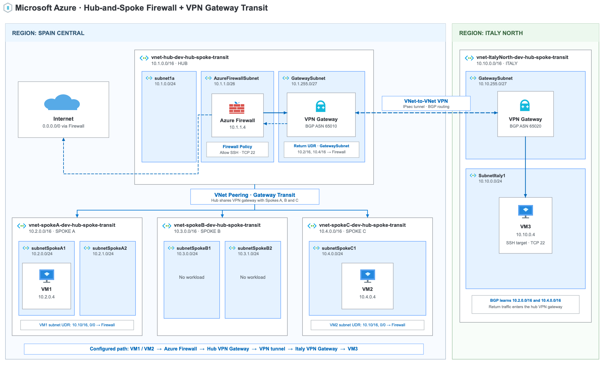

# Hub and Spoke with Azure Firewall and VPN Gateway

A personal Azure architecture playground for experimenting with routing between spokes, controlled internet egress, and connectivity between regions.

## Diagram



## Part 1 — Hub-and-spoke peering, Firewall, and UDRs

The hub is peered with Spokes A, B, and C. There is no direct peering between spokes. UDRs on the VM1 and VM2 subnets send traffic for the other spoke and `0.0.0.0/0` through Azure Firewall.

The Firewall Policy allows SSH between VM1 and VM2, HTTPS to `api.ipify.org`, and the traffic required for Run Command. Spoke B is peered but has no workload.

### Tests

In the Azure portal, open **Virtual machines → VM1 or VM2 → Operations → Run command → RunShellScript**.

**Spoke-to-spoke traffic:** run on VM1 and VM2 respectively:

```bash
nc -vz -w 5 10.4.0.4 22
```

```bash
nc -vz -w 5 10.2.0.4 22
```

Both commands should report that port 22 is reachable.

**Internet egress:** run on both VMs:

```bash
curl -sS --max-time 10 https://api.ipify.org
```

Both should return the Azure Firewall public IP.

**Routing:** in **Network Watcher → Next hop**, check:

| Source | Destination | Expected next hop |
| --- | --- | --- |
| VM1 | `10.4.0.4` | `VirtualAppliance` — Firewall private IP |
| VM2 | `10.2.0.4` | `VirtualAppliance` — Firewall private IP |
| VM1 and VM2 | `8.8.8.8` | `VirtualAppliance` — Firewall private IP |

## Part 2 — VNet-to-VNet VPN Gateway

**Goal:** connect Italy North to the hub through Virtual Network Gateways and examine the resulting traffic paths.

### Architecture and configuration


### Tests

